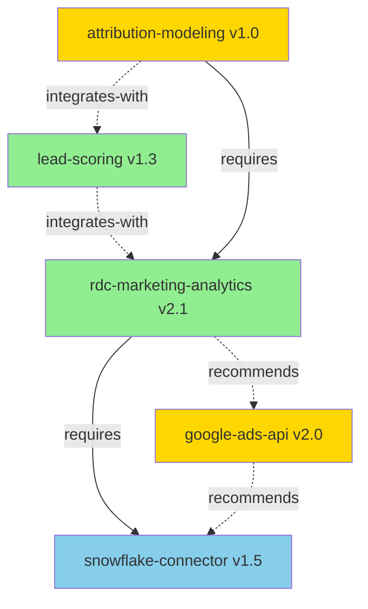

# Skill Graph Schema

The skill graph is a centralized JSON file that maps relationships between all skills in the repository. It enables dependency resolution, conflict detection, and workflow optimization.

## Purpose

The `skill-graph.json` file:
- Maps all skill dependencies and relationships
- Enables automated dependency checking
- Identifies conflicts between skills
- Discovers complementary skill combinations
- Powers the recommendation engine
- Visualizes the skill ecosystem

## Location

`MoveRDC/claude-skills-marketing/skill-graph.json`

## Schema

```json
{
  "version": "1.0",
  "updated": "2024-03-20T10:30:00Z",
  "nodes": [
    {
      "id": "skill-name",
      "version": "1.0.0",
      "type": "skill",
      "maturity": "stable",
      "domains": ["domain1", "domain2"],
      "metadata_path": "skills/skill-name/metadata.json"
    }
  ],
  "edges": [
    {
      "from": "skill-a",
      "to": "skill-b",
      "type": "requires",
      "version_constraint": ">=1.0.0",
      "required": true
    }
  ],
  "workflows": [
    {
      "name": "Campaign Analysis",
      "description": "Analyze marketing campaign performance",
      "skills": ["skill-a", "skill-b", "skill-c"],
      "sequence": ["skill-a", "skill-b", "skill-c"]
    }
  ]
}
```

## Node Schema

Each node represents a skill in the ecosystem.

```json
{
  "id": "rdc-marketing-analytics",
  "version": "2.1.0",
  "type": "skill",
  "maturity": "stable",
  "domains": ["marketing", "analytics", "real-estate"],
  "tags": ["sem", "ppc", "conversion-tracking"],
  "metadata_path": "skills/rdc-marketing-analytics/metadata.json",
  "install_count": 45,
  "last_used": "2024-03-20",
  "maintainer": "marketing-analytics@move.com"
}
```

### Node Fields

- **id**: Unique skill identifier (matches skill folder name)
- **version**: Current version (semver)
- **type**: Always "skill" (reserved for future tool/service types)
- **maturity**: experimental | beta | stable | deprecated
- **domains**: Broad categories (marketing, analytics, etc.)
- **tags**: Specific categorization tags
- **metadata_path**: Path to skill's metadata.json
- **install_count**: Number of active installations (optional)
- **last_used**: Most recent usage timestamp (optional)
- **maintainer**: Contact for skill owner (optional)

## Edge Schema

Each edge represents a relationship between two skills.

```json
{
  "from": "rdc-marketing-analytics",
  "to": "snowflake-connector",
  "type": "requires",
  "version_constraint": ">=1.5.0",
  "required": true,
  "reason": "Needs Snowflake connection for data queries"
}
```

### Edge Types

- **requires**: Hard dependency (skill cannot function without it)
- **recommends**: Soft dependency (enhances functionality)
- **integrates-with**: Works together but independently useful
- **extends**: Builds upon or specializes another skill
- **conflicts-with**: Cannot be used together
- **replaces**: Supersedes another skill (for deprecation)

### Edge Fields

- **from**: Source skill id
- **to**: Target skill id
- **type**: Relationship type (see above)
- **version_constraint**: Required version (semver constraint)
- **required**: Boolean - true for hard dependencies
- **reason**: Human-readable explanation (optional but recommended)
- **since**: When this relationship was added (optional)

## Workflow Schema

Workflows define common multi-skill sequences.

```json
{
  "name": "Campaign Performance Analysis",
  "description": "Complete analysis of marketing campaign effectiveness",
  "skills": [
    "rdc-marketing-analytics",
    "lead-scoring", 
    "attribution-modeling"
  ],
  "sequence": [
    "rdc-marketing-analytics",
    "lead-scoring",
    "attribution-modeling"
  ],
  "parallel": [],
  "triggers": [
    "analyze campaign performance",
    "campaign analysis",
    "how did campaigns perform"
  ],
  "estimated_time": "2-5 minutes",
  "common_use_cases": [
    "Monthly campaign review",
    "Quarterly performance assessment",
    "Budget allocation decisions"
  ]
}
```

### Workflow Fields

- **name**: Workflow identifier
- **description**: What the workflow accomplishes
- **skills**: All skills involved (unordered)
- **sequence**: Ordered list for sequential execution
- **parallel**: Skills that can run concurrently (optional)
- **triggers**: Phrases that should invoke this workflow
- **estimated_time**: Expected completion time
- **common_use_cases**: When to use this workflow

## Example: Complete Skill Graph

```json
{
  "version": "1.0",
  "updated": "2024-03-20T10:30:00Z",
  
  "nodes": [
    {
      "id": "rdc-marketing-analytics",
      "version": "2.1.0",
      "type": "skill",
      "maturity": "stable",
      "domains": ["marketing", "analytics"],
      "tags": ["sem", "ppc", "conversion"],
      "metadata_path": "skills/rdc-marketing-analytics/metadata.json"
    },
    {
      "id": "snowflake-connector",
      "version": "1.5.0",
      "type": "skill",
      "maturity": "stable",
      "domains": ["data", "infrastructure"],
      "tags": ["database", "sql"],
      "metadata_path": "skills/snowflake-connector/metadata.json"
    },
    {
      "id": "google-ads-api",
      "version": "2.0.0",
      "type": "skill",
      "maturity": "beta",
      "domains": ["marketing", "api"],
      "tags": ["google-ads", "sem"],
      "metadata_path": "skills/google-ads-api/metadata.json"
    },
    {
      "id": "lead-scoring",
      "version": "1.3.0",
      "type": "skill",
      "maturity": "stable",
      "domains": ["marketing", "analytics"],
      "tags": ["leads", "scoring", "quality"],
      "metadata_path": "skills/lead-scoring/metadata.json"
    },
    {
      "id": "attribution-modeling",
      "version": "1.0.0",
      "type": "skill",
      "maturity": "beta",
      "domains": ["marketing", "analytics"],
      "tags": ["attribution", "multi-touch"],
      "metadata_path": "skills/attribution-modeling/metadata.json"
    }
  ],
  
  "edges": [
    {
      "from": "rdc-marketing-analytics",
      "to": "snowflake-connector",
      "type": "requires",
      "version_constraint": ">=1.5.0",
      "required": true,
      "reason": "Needs Snowflake for campaign data queries"
    },
    {
      "from": "rdc-marketing-analytics",
      "to": "google-ads-api",
      "type": "recommends",
      "version_constraint": ">=2.0.0",
      "required": false,
      "reason": "Enhances with real-time Google Ads data"
    },
    {
      "from": "lead-scoring",
      "to": "rdc-marketing-analytics",
      "type": "integrates-with",
      "version_constraint": ">=2.0.0",
      "required": false,
      "reason": "Uses campaign data for lead context"
    },
    {
      "from": "attribution-modeling",
      "to": "rdc-marketing-analytics",
      "type": "requires",
      "version_constraint": ">=2.0.0",
      "required": true,
      "reason": "Needs campaign data for attribution analysis"
    },
    {
      "from": "attribution-modeling",
      "to": "lead-scoring",
      "type": "integrates-with",
      "version_constraint": ">=1.0.0",
      "required": false,
      "reason": "Incorporates lead quality in attribution"
    },
    {
      "from": "google-ads-api",
      "to": "snowflake-connector",
      "type": "recommends",
      "version_constraint": ">=1.0.0",
      "required": false,
      "reason": "Can sync Google Ads data to Snowflake"
    }
  ],
  
  "workflows": [
    {
      "name": "Campaign Performance Analysis",
      "description": "Comprehensive campaign analysis with lead quality assessment",
      "skills": ["rdc-marketing-analytics", "lead-scoring"],
      "sequence": ["rdc-marketing-analytics", "lead-scoring"],
      "triggers": [
        "analyze campaign performance",
        "how are campaigns doing",
        "campaign quality analysis"
      ],
      "estimated_time": "2-3 minutes"
    },
    {
      "name": "Attribution Analysis",
      "description": "Multi-touch attribution across campaigns with lead scoring",
      "skills": ["rdc-marketing-analytics", "attribution-modeling", "lead-scoring"],
      "sequence": ["rdc-marketing-analytics", "attribution-modeling", "lead-scoring"],
      "triggers": [
        "attribution analysis",
        "multi-touch attribution",
        "conversion path analysis"
      ],
      "estimated_time": "3-5 minutes"
    },
    {
      "name": "Real-time Campaign Monitoring",
      "description": "Live campaign performance with Google Ads integration",
      "skills": ["google-ads-api", "rdc-marketing-analytics"],
      "sequence": ["google-ads-api", "rdc-marketing-analytics"],
      "parallel": ["google-ads-api"],
      "triggers": [
        "current campaign performance",
        "live campaign data",
        "real-time ads performance"
      ],
      "estimated_time": "1-2 minutes"
    }
  ]
}
```

## Using the Skill Graph

### 1. Dependency Resolution

To install a skill, traverse the graph to find all required dependencies:

```
User wants to install: attribution-modeling

Graph traversal:
attribution-modeling
├── requires: rdc-marketing-analytics (>=2.0.0)
│   └── requires: snowflake-connector (>=1.5.0)
└── integrates-with: lead-scoring (>=1.0.0) [optional]

Installation order:
1. snowflake-connector (v1.5.0+)
2. rdc-marketing-analytics (v2.0.0+)
3. attribution-modeling (v1.0.0)
4. [optional] lead-scoring (v1.0.0+)
```

### 2. Conflict Detection

Check for conflicts before installation:

```python
def check_conflicts(skill_id, installed_skills):
    conflicts = find_edges(from=skill_id, type="conflicts-with")
    for conflict in conflicts:
        if conflict.to in installed_skills:
            return f"Cannot install {skill_id}: conflicts with {conflict.to}"
    return None
```

### 3. Workflow Discovery

When user describes a task, match against workflow triggers:

```
User: "I need to analyze attribution for our campaigns"

Match workflows:
1. "Attribution Analysis" - triggers include "attribution analysis"
   Skills needed: rdc-marketing-analytics, attribution-modeling, lead-scoring
   
Suggest: "I can help with that using the Attribution Analysis workflow.
         You'll need: rdc-marketing-analytics, attribution-modeling, and lead-scoring.
         Would you like me to guide you through installation?"
```

### 4. Recommendation Generation

Identify missing skills based on usage patterns:

```
Observed: User frequently queries campaign data + lead quality separately

Graph analysis:
- User has: rdc-marketing-analytics, lead-scoring
- Workflow "Campaign Performance Analysis" combines these
- Suggests: Use workflow for integrated analysis

Recommendation: "You're analyzing campaigns and lead quality separately. 
                 The 'Campaign Performance Analysis' workflow can do both 
                 in one query. Want to try it?"
```

## Maintaining the Skill Graph

### When to Update

Update `skill-graph.json` when:
- New skill is added (add node)
- Skill is removed (remove node)
- Dependencies change (add/remove/modify edges)
- New version released (update node version)
- Workflow is created (add to workflows)
- Relationship discovered (add edge)

### Update Process

1. **Fetch current graph**: `github:get_file_contents` for skill-graph.json
2. **Make changes**: Add/update nodes, edges, or workflows
3. **Validate**: Ensure no orphaned references, circular dependencies
4. **Update timestamp**: Set `updated` field
5. **Commit**: `github:create_or_update_file` with descriptive message

### Validation Rules

- All edge `from`/`to` must reference existing nodes
- No circular `requires` dependencies
- Version constraints must be valid semver
- Each node `id` must be unique
- Workflow `skills` must all exist as nodes

## Graph Visualization

The skill graph can be visualized for better understanding:



Legend:
- Solid lines: Hard dependencies (requires)
- Dashed lines: Soft dependencies (recommends/integrates-with)
- Green: Stable
- Yellow: Beta
- Red: Experimental/Deprecated

## Best Practices

1. **Keep graph synchronized**: Update when any skill changes
2. **Document relationships**: Always include `reason` in edges
3. **Use semantic versioning**: Version constraints should be meaningful
4. **Create workflows**: Document common multi-skill patterns
5. **Validate regularly**: Check for orphaned references and circular deps
6. **Track maturity**: Update node maturity as skills evolve
7. **Add metadata paths**: Always link to skill's metadata.json
8. **Descriptive workflow names**: Make workflows discoverable via triggers
